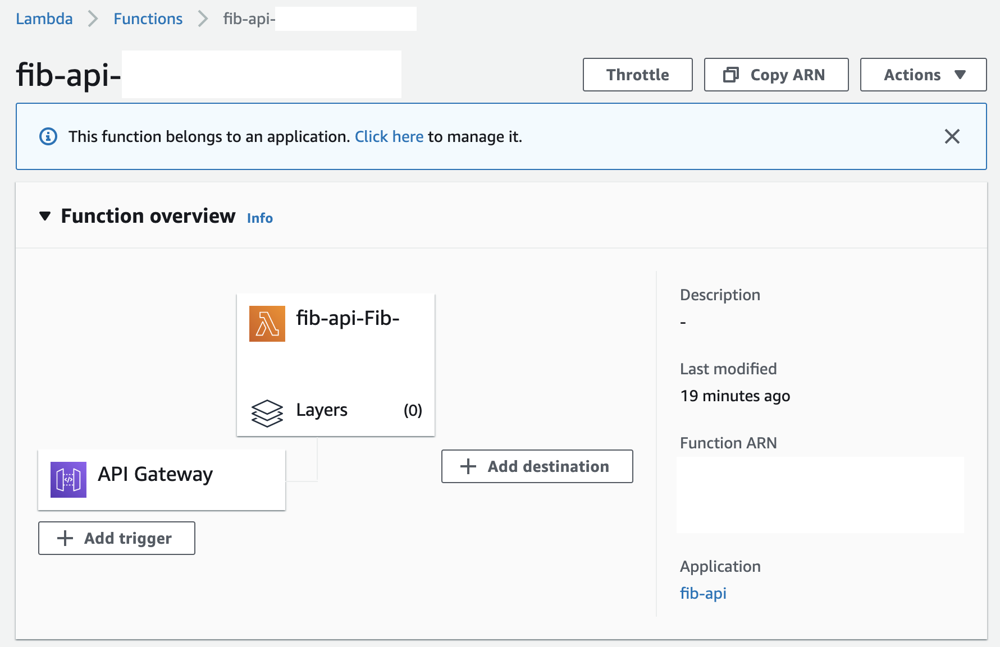

# Kotlin sample app using AWS API Gateway, Lambda and DynamoDB

The application uses a Lambda function behind API Gateway to compute values of the Fibonacci sequence.

It also uses DynamoDB as a memoization cache to read previously computed values and to add newly computed values.

**Note:** The first time you deploy you have to add an inline policy to the Lambda role allowing it access to DynamoDB.

The structure of the deployed system should be:

