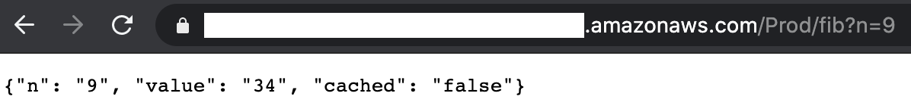
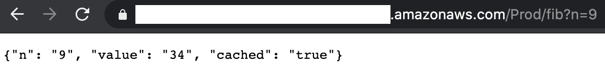
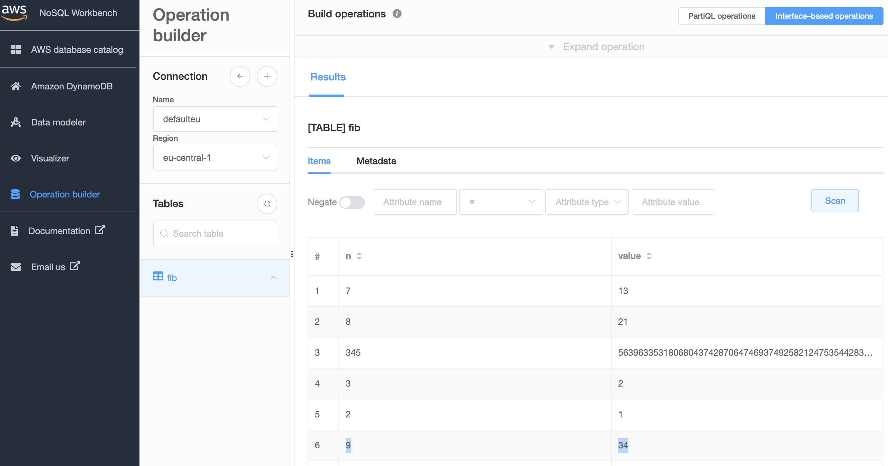

# Serverless [Kotlin](https://kotlinlang.org/) sample app using AWS API Gateway, Lambda and DynamoDB

The application uses a [Lambda](https://docs.aws.amazon.com/lambda/?id=docs_gateway) function behind [API Gateway](https://docs.aws.amazon.com/apigateway/?id=docs_gateway) to compute values of the Fibonacci sequence.

It also uses [DynamoDB](https://docs.aws.amazon.com/dynamodb/?id=docs_gateway) as a memoization cache to read previously computed values and to add newly computed values.

**Note:** the lambda function gets full access to DynamoDB, please consider this before deploying/running and adjust the `Policies` under [template.yaml](template.yaml) as desired.

The structure of the deployed system should be:

Once the system is deployed, you can use the application's endpoint to retrieve cached or computed values:

* Value is not cached but computed:

* Value is now cached (retrieved from DynamoDB):

We note the presence of the new entry for `n: 9, value: 34` in the corresponding view of AWS [NoSQL Workbench](https://docs.aws.amazon.com/amazondynamodb/latest/developerguide/workbench.html):

